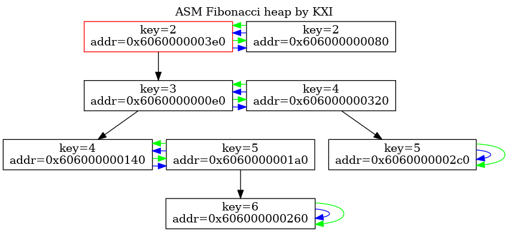

# Fibonacci Heap


## Требования
- СИ
- C++20 (g++ compiler)
- nasm
- graphviz
- cmake

### Компиляция тестового варианта
```bash
./runbuild.sh
```
### Запуск тестового варианта
```
./asm_fib_heap.out
```
Команды:
- 1 {number} (вставить узел)
- 2 (извлечь минимум)
- 3 (удалить последний добалвенный)

Куча будет отображаться в файле `fib_heap.png`

#### Пример
```bash
1 1
1 2
1 3
1 4
1 5
1 6
1 5
1 4
1 3
1 2
1 1
3
2
3
```
Результат:


### Запуск тестов
```bash
./test.sh
```
### Эксплутатация
```bash
doxygen
```